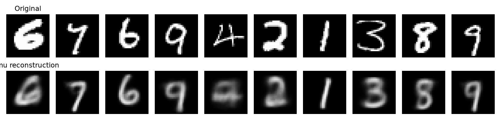
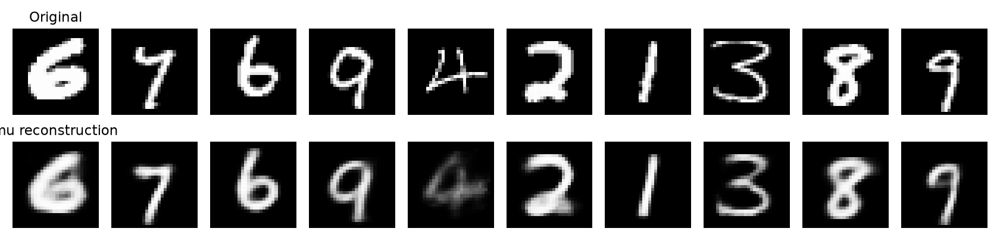
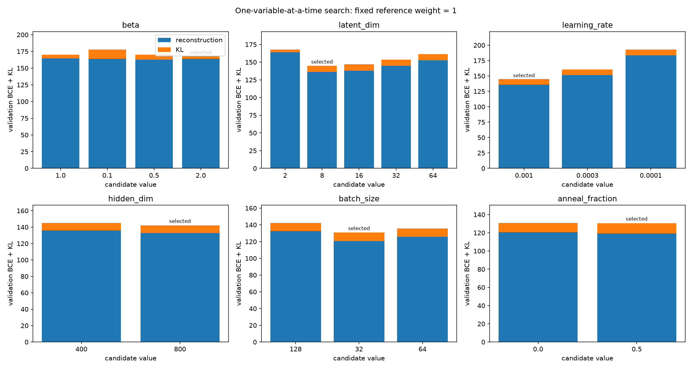

# VAE 튜닝 실험 (2026-09-29)

## 조건과 선택 기준

- ResNet 인코더 채널 32→64→128, MNIST BCE soft target, Adam, seed=42.
- 고정 원본 분할: 학습 54,000장 / 검증 6,000장. 탐색에는 그중 6,000장 / 1,000장 사용, 후보마다 10 epoch.
- 각 단계는 직전 선택값에서 한 변수만 변경하고 처음부터 학습. 테스트 집합은 탐색에 사용하지 않음.
- 비교 기준은 **검증 BCE+KL(고정 가중치 1)**. 학습 total=BCE+effective_beta×KL은 별도 기록.
- 각 후보의 최적 epoch를 같은 기준으로 선택. Annealing 후보는 목표 β에 도달한 이후의 epoch만 선택 가능.
- 모든 검증은 배치 크기 128, 고정 샘플링 seed=1042. 복원 그림은 동일한 10장에 z=mu 사용.
- RTX 3060 12GB. 아래 GPU 메모리는 PyTorch 텐서 최대 할당량으로, 드라이버/다른 프로세스의 사용량을 포함하지 않음.

## 후보별 탐색 결과

| 실험 | β | 잠재 차원 | 학습률 | hidden | batch | anneal 비율 | epoch | val total | val recon | val KL | 공통 BCE+KL | GPU MB |
|---|---:|---:|---:|---:|---:|---:|---:|---:|---:|---:|---:|---:|
| 00_beta_1.0 | 1.0 | 2 | 0.001 | 400 | 128 | 0.0 | 10 | 169.913 | 164.684 | 5.229 | 169.913 | 248.292 |
| 01_beta_0.1 | 0.1 | 2 | 0.001 | 400 | 128 | 0.0 | 10 | 165.648 | 164.264 | 13.842 | 178.105 | 248.292 |
| 02_beta_0.5 | 0.5 | 2 | 0.001 | 400 | 128 | 0.0 | 10 | 166.366 | 162.639 | 7.456 | 170.094 | 248.292 |
| 03_beta_2.0 | 2.0 | 2 | 0.001 | 400 | 128 | 0.0 | 10 | 172.103 | 163.977 | 4.063 | 168.040 | 248.292 |
| 04_latent_dim_8 | 2.0 | 8 | 0.001 | 400 | 128 | 0.0 | 10 | 153.860 | 136.163 | 8.849 | 145.012 | 248.403 |
| 05_latent_dim_16 | 2.0 | 16 | 0.001 | 400 | 128 | 0.0 | 10 | 156.489 | 137.733 | 9.378 | 147.111 | 248.558 |
| 06_latent_dim_32 | 2.0 | 32 | 0.001 | 400 | 128 | 0.0 | 10 | 162.083 | 144.729 | 8.677 | 153.406 | 248.866 |
| 07_latent_dim_64 | 2.0 | 64 | 0.001 | 400 | 128 | 0.0 | 10 | 169.961 | 152.812 | 8.574 | 161.387 | 249.483 |
| 08_learning_rate_0.0003 | 2.0 | 8 | 0.0003 | 400 | 128 | 0.0 | 10 | 169.118 | 151.587 | 8.766 | 160.352 | 248.403 |
| 09_learning_rate_0.0001 | 2.0 | 8 | 0.0001 | 400 | 128 | 0.0 | 10 | 202.706 | 183.732 | 9.487 | 193.219 | 248.403 |
| 10_hidden_dim_800 | 2.0 | 8 | 0.001 | 800 | 128 | 0.0 | 10 | 151.565 | 132.792 | 9.387 | 142.179 | 254.235 |
| 11_batch_size_32 | 2.0 | 8 | 0.001 | 800 | 32 | 0.0 | 10 | 140.661 | 120.785 | 9.938 | 130.723 | 91.685 |
| 12_batch_size_64 | 2.0 | 8 | 0.001 | 800 | 64 | 0.0 | 10 | 145.397 | 125.738 | 9.829 | 135.567 | 146.136 |
| 13_anneal_fraction_0.5 | 2.0 | 8 | 0.001 | 800 | 32 | 0.5 | 10 | 141.274 | 119.480 | 10.897 | 130.377 | 91.685 |

## 단계별 해석

- β: 0.5는 복원 162.64로 β=2의 163.98보다 약간 좋지만, KL이 7.46으로 더 큼. 공통 기준에서 β=2 선택. β=0.1은 이번 조건에서 복원 이득 없이 KL이 크게 증가함.
- 잠재 차원: 2→8에서 복원 163.98→136.16으로 가장 큰 개선. 16/32/64는 이 학습 예산에서 더 좋은 결과를 보이지 않음.
- 학습률: 1e-3 선택. 3e-4, 1e-4는 10 epoch에서 점수가 낮지 않았음. 낮은 학습률이 본질적으로 나쁘다는 결론은 아니며 더 긴 수렴 시간이 필요할 수 있음.
- 용량: hidden 400→800에서 복원 136.16→132.79로 개선. 인코더 채널 수는 고정하여 용량 변수 하나만 변경함.
- batch: 32에서 복원 120.78, 64에서 125.74, 128에서 132.79. 같은 epoch에서도 작은 batch는 업데이트 횟수가 많으므로 효과를 batch 크기만의 특성으로 단정할 수 없음. 모두 메모리 범위 안에서 완료됨.
- annealing: 학습 전반 5 epoch에 β=0→2, 이후 2 유지. 복원 120.78→119.48, KL 9.94→10.90, 공통 점수 130.72→130.38. 작은 개선이므로 seed 반복 없이 우위를 단정하지 않음.
- 복원 이미지를 직접 확인하면 기존 2차원의 6→0, 2→8 같은 형태 손실이 선택 설정에서 줄었음. 가는 획의 4는 여전히 흐릿하여 개선 여지가 있음. 이는 고정된 10개 예시에 대한 정성 관찰임.

## 기록 위치와 재현

- [전체 탐색 CSV](assets/vae_tuning_20260929/search_summary.csv)
- [실험별 비교 노트북](../notebooks/03_vae_tuning.ipynb)
- 각 실험 폴더의 `history.csv`: epoch별 train/validation total, reconstruction, KL, 공통 점수, BCE, pixel MSE, effective β.
- 각 실험 폴더의 `reconstruction.png`, `curves.png`, `best.pt`: 복원 그림, 손실 곡선, 선택된 가중치.
- `split_indices.npz`, `manifest.json`: 실제 분할 인덱스, 실행 조건, 원본 모델 정의 해시.
- `outputs/`는 Git 제외 대상이므로 가중치/이미지는 별도 보관해야 함. 아래 명령은 새 경로를 사용함.

```bash
python examples/vae_tuning.py --output outputs/notebooks/vae/new_search --epochs 10 --train-limit 6000 --val-limit 1000
python examples/vae_tuning.py --confirm-from outputs/notebooks/vae/new_search --output outputs/notebooks/vae/new_confirmation --epochs 20
```

## 해석 범위

단일 seed의 순차 탐색이며 β와 잠재 차원 등의 상호작용을 전부 탐색하지 않음. 검증 데이터를 반복 사용해 선택했으므로 전체 데이터 확인과 별도 최종 테스트를 구분함. 재구성과 KL의 공통 균형 기준이며 재구성만 최적화하는 설정과는 다를 수 있음. 생성 이미지 품질/FID 또는 downstream 성능은 이번 지표에 포함되지 않음.

MNIST에서는 BCE를 유지했으며 Gaussian likelihood는 실행 모듈에서 지원하지만 이번 탐색에서는 비교하지 않음. 연속 픽셀 데이터로 바꾸는 후속 실험에서는 고정 sigma와 공통 pixel MSE 등을 함께 기록해야 함.

## 전체 데이터 확인 결과

학습 54,000장 / 검증 6,000장, 각 20 epoch, seed=42. 최종 선택은 검증 공통 점수에만 근거함.

| 설정 | 선택 epoch | val total | val recon | val KL | 공통 BCE+KL | pixel MSE |
|---|---:|---:|---:|---:|---:|---:|
| baseline | 19 | 149.53848 | 143.50292 | 6.03556 | 149.53848 | 0.04095 |
| tuned | 18 | 122.52578 | 95.45861 | 13.53359 | 108.99219 | 0.01968 |

검증 reconstruction은 **33.5% 감소**함. β가 1→2로 달라졌으므로 raw total 대신 고정 기준 BCE+KL을 비교함.

최종 선택 설정: `{"beta": 2.0, "latent_dim": 8, "learning_rate": 0.001, "hidden_dim": 800, "batch_size": 32, "anneal_fraction": 0.5, "likelihood": "bce", "gaussian_sigma": 0.1}`. Annealing은 20 epoch 중 처음 10 epoch에 0→2로 증가.

테스트 10,000장 최종 평가: total=121.30688, reconstruction=94.27834, kl=13.51427, reference=107.79261, bce=94.27834, pixel_mse=0.01927. 테스트 점수로 설정을 다시 선택하지 않았음.

[전체 데이터 CSV](assets/vae_tuning_20260929/confirmation_summary.csv), 최종 가중치(로컬 전용): `outputs/notebooks/vae/confirmation_20260929/selected.pt`, [기존 복원 이미지](assets/vae_tuning_20260929/baseline_reconstruction.png), [튜닝 후 복원 이미지](assets/vae_tuning_20260929/tuned_reconstruction.png).

검증된 기본값과 annealing을 `02_vae_mnist.ipynb`에 반영했음. 기존 노트북의 검증 모델 선택도 고정 BCE+KL 기준으로 맞췄으며, 전체 실험 결과와 학습된 모델 로딩은 `03_vae_tuning.ipynb`에서 확인 가능함.

## 복원 결과

아래 핵심 이미지와 요약 CSV는 `reports/assets/`에 포함되어 GitHub에서도 확인할 수 있습니다. 후보별 전체 기록과 모델 가중치는 Git에 포함되지 않으며 위 실행 명령으로 다시 생성합니다.

기존 설정:



튜닝 후:



단계별 비교:


